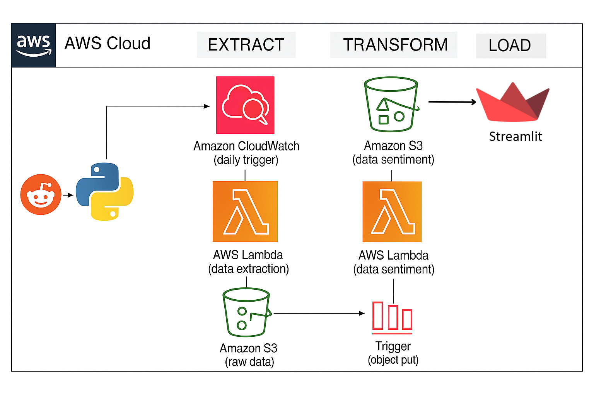

# Reddit AI Sentiment Pipeline (AWS + Streamlit)

An end-to-end, serverless pipeline that automates extraction of Reddit posts, runs sentiment analysis using **Amazon Comprehend**, stores results in **S3** (JSON + CSV) and exposes insights via a production-ready **Streamlit** dashboard.

---

## 🚀 Project Summary
This project implements a full **serverless ETL + ML pipeline** powered by AWS:

- **Extractor Lambda** (Python + `praw`) fetches posts from configured subreddits, applies a **data validation layer** (missing-field checks, null filtering, schema normalization), and stores clean structured JSON into S3.
- **Sentiment Lambda** (Python + `boto3`) is triggered by S3 `PUT` events, calls **Amazon Comprehend** to generate sentiment labels & scores, and writes enriched JSON + CSV outputs back to S3.
- **Streamlit Dashboard** loads the latest CSV from S3 and visualizes KPIs, sentiment distribution, top authors, keyword patterns, and interactive post links.

---

## 🔧 Features
- Fully **serverless** pipeline using Lambda, S3, CloudWatch, and Amazon Comprehend.
- Automated ingestion and processing triggered by S3 events.
- Data stored in both **JSON** (`processed_data/`) and **CSV** (`csv_data/`) formats.
- Streamlit dashboard includes subreddit filtering, metric summaries, sentiment charts, TF–IDF keywords, and clickable post previews.
- Cost-efficient architecture built entirely on on-demand AWS services.
- **Integrated Data Validation Layer** before ingestion:
  - missing-field checks (`id`, `title`, `author`, `score`)
  - null/empty-title filtering  
  - schema standardization (consistent typing + cleaned keys)  
  - safe fallback for missing authors  
- Enforced structured output using a `validation_status` flag for every record.

---

## 🏗 Architecture



---

## Execution Video


https://github.com/user-attachments/assets/2add6c18-dc0f-4d86-a456-b65f59591984


---

## 📁 Repository Structure

```
├── README.md
├── lambda-extractor/ # Extract Lambda code 
│ └── lambda_function.py
├── lambda-sentiment/ # Sentiment Lambda code 
│ └── lambda_function.py
├── Dashboard/ # Streamlit dashboard
│ └── streamlit_app.py
├── assets/
│ └── architecture.png 
├── requirements.txt
```

---

## 🛠 Setup & Deployment (high-level)

### Prerequisites
- AWS account with permissions to create Lambda, S3, IAM, and use Comprehend.
- Reddit API credentials (create an app at https://www.reddit.com/prefs/apps).
- Local machine: Python 3.10+ and `pip`, or use Cloud IDE.

---

### 1) Create S3 bucket
- Bucket name example: `reddit-ml-vikas` (use your own unique name).
- Create folders (prefixes) will be used automatically:
  - `raw_data/to_process/`
  - `processed_data/`
  - `csv_data/`

Enable default encryption with **SSE-S3** (recommended).

---

### 2) IAM Role for Lambdas
Create an IAM role for Lambda with the following managed policies (or create least-privilege equivalents):
- `AmazonS3FullAccess` (or restrict to required S3 actions & bucket)
- `ComprehendFullAccess` (needed for sentiment Lambda)
- `AWSLambdaBasicExecutionRole` / `CloudWatchLogsFullAccess`

---

### 3) Extractor Lambda (reddit-extractor)

**Runtime:** Python 3.12  
**File:** `lambda-extractor/lambda_function.py`  
**Libraries:** `praw`, `boto3`  
**Trigger:** CloudWatch (scheduled)

**Environment Variables**
- `REDDIT_CLIENT_ID`  
- `REDDIT_CLIENT_SECRET`  
- `REDDIT_USER_AGENT`  
- `S3_BUCKET`  
- `SUBREDDITS` (comma-separated)  
- `POST_LIMIT`  
- `S3_PREFIX` (e.g., `raw_data/to_process/`)

**Lambda Configuration**
- Handler: `lambda_function.lambda_handler`
- Memory: 256 MB
- Timeout: 30–60 seconds

**Behavior**
- Fetches posts from configured subreddits.
- Deduplicates posts using the Reddit post ID.
- Writes raw Reddit post data to `raw_data/to_process/` on S3.

**Data Validation Layer (Enhancement)**
- Ensures required keys exist before processing.  
- Skips posts with invalid or missing data.  
- Normalizes schema (string IDs, cleaned titles, typed numeric fields).  
- Adds a `validation_status` flag to each record.

--- 


### 4) Sentiment Lambda (reddit-sentiment)
**Runtime:** Python 3.12  
**File:** `lambda-sentiment/lambda_function.py`  
**Libraries:** `pandas`, `boto3`  
**Trigger:** S3 object-created event (`raw_data/to_process/` → Lambda)

**Environment Variables**
- `OUTPUT_BUCKET`

**Behavior**
- Reads cleaned Reddit JSON from S3.
- Calls **Amazon Comprehend** to detect sentiment.
- Enriches each post with:
  - `Sentiment` label  
  - `SentimentScore`  
- Saves enriched data to:
  - `processed_data/` (JSON)  
  - `csv_data/` (CSV)

---

### 5) Streamlit Dashboard (local / cloud)
- File: `Dashboard/streamlit_app.py`
- Requirements (examples):
  ```text
  streamlit
  boto3
  pandas
  scikit-learn
